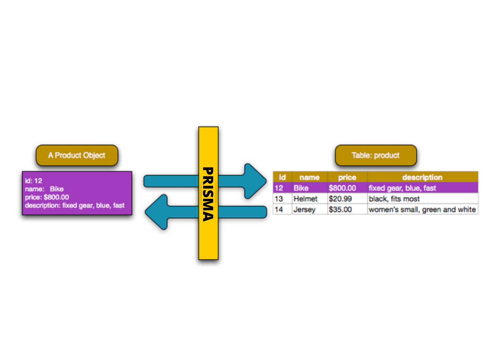
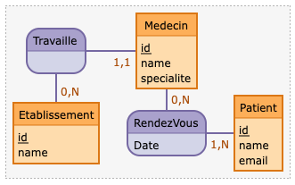

# Documentation

## Introduction

Nous allons ensemble, apprendre prisma 🎊 !

Vous allez voir, c'est beaucoup plus simple que ce que vous pensez!

Déjà, c'est quoi prisma?

Prisma est un ORM (Object Relational Mapping) qui permet de faire le lien entre votre base de données et votre code.



En gros, prisma va vous permettre de faire des requêtes SQL sans avoir à écrire de requêtes SQL


## Installation

Pour commencer, il faut installer prisma dans votre projet.

```bash
npm install prisma
```

<details>
<summary>Pshit ! Tu veux de la doc' ?</summary>

[Start from scratch with relational databases (15 min) | node-mysql](https://www.prisma.io/docs/getting-started/setup-prisma/start-from-scratch/relational-databases-node-mysql)

</details>

Ensuite, il faut initialiser prisma dans votre projet.

```bash
npx prisma init
```

Une fois que c'est fait, vous allez avoir un dossier prisma qui va contenir un fichier prisma.schema ainsi qu'un fichier .env qui va contenir les informations de connexion à votre base de données.

### Et voilà ! Vous êtes prêt à commencer à utiliser prisma 🎉

## Création d'une base de données

Nous allons créer la base de données, avec laquelle nous allons travailler.

Pour cela, nous allons nous intéresser à la méthode MERISE qui va nous aider à créer notre base de données.

-   Un medecin peut avoir plusieurs patients
-   Un patient doit avoir au moins un medecin
-   Un patient peut avoir plusieurs rendez-vous
-   Un rendez-vous ne peut avoir qu'un seul patient
-   Un rendez-vous ne peut avoir qu'un seul medecin
-   Un medecin ne peut avoir qu'un seul etablissement
-   Un établissement peut avoir plusieurs medecins

<details>
<summary>Voilà le code pour l'avoir sur le site mocodo.net</summary>

Travaille, 0N Etablissement, 11 Medecin
Medecin: id, name, specialite
:

Etablissement: id, name
RendezVous, 1N Patient, 0N Medecin: Date
Patient: id, name, email

</details>



Maintenant que nous avons le modèle de notre base de données, nous allons pouvoir la créer.

## Création des tables

Voilà le modèle de notre base de données

```js
// prisma/schema.prisma

model Patient {
  id        Int      @id @default(autoincrement())
  createdAt DateTime @default(now())
  name      String
  email     String   @unique
}

model Medecin {
  id        Int      @id @default(autoincrement())
  createdAt DateTime @default(now())
  name      String
  email     String   @unique
  specialite String
}

model Etablisement {
  id        Int      @id @default(autoincrement())
  name      String
}

model RendezVous {
  id        Int      @id @default(autoincrement())
  createdAt DateTime @default(now())
  date      DateTime
}
```

Mais il manque les relations entre les tables.

```js
// Avec les relations
model Patient {
  id        Int      @id @default(autoincrement())
  createdAt DateTime @default(now())
  name      String
  email     String   @unique
  // relation avec rendezVous
  rendezVous RendezVous[]
}

model Medecin {
  id        Int      @id @default(autoincrement())
  createdAt DateTime @default(now())
  name      String
  email     String   @unique
  specialite String
  // relation avec etablissement (FK)
  etablisementId Int
  etablisement Etablisement @relation(fields: [etablisementId], references: [id])
    // relation avec rendezVous
  rendezVous RendezVous[]
}

model Etablisement {
  id        Int      @id @default(autoincrement())
  name      String
  // relation avec medecin
  medecins  Medecin[]
}

model RendezVous {
  id        Int      @id @default(autoincrement())
  createdAt DateTime @default(now())
  date      DateTime
  // relation avec patient (FK)
  patientId Int
  patient   Patient  @relation(fields: [patientId], references: [id])
  // relation avec medecin (FK)
  medecinId Int
  medecin   Medecin  @relation(fields: [medecinId], references: [id])
}
```
